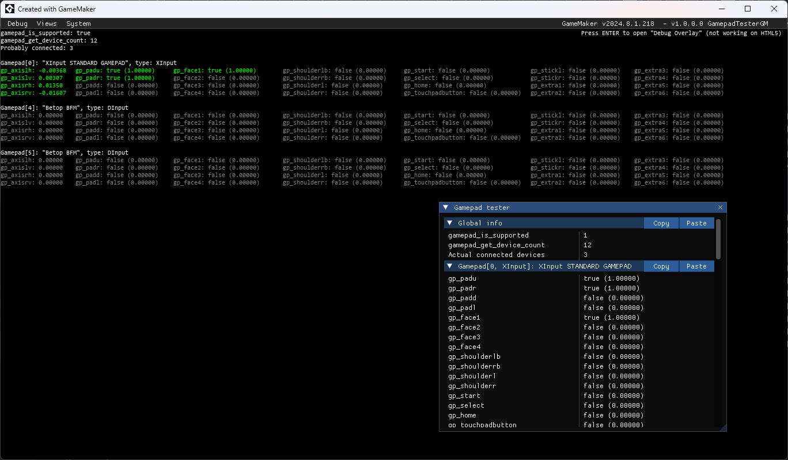

# GamepadTesterGM
Gamepad tester for GameMaker. Use this to test how games made on GameMaker work with gamepads. You can test several gamepads at once. This project can be used in your games. Just copy object `o_debug_overlay_gamepad_tester` or `o_draw_gui_gamepad_tester` into your project and place it in the room:
* `o_debug_overlay_gamepad_tester` - Debug overlay. Not working on HTML5
* `o_draw_gui_gamepad_tester` - Draws in `Draw GUI` event. Works everywhere

Example of displaying two objects at once:

  

